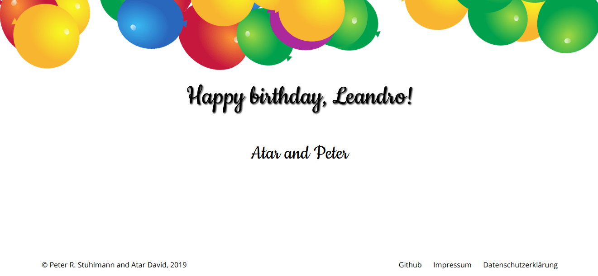

# Happy Birthday Landingpage

[](https://github.com/peter-stuhlmann/HappyBirthday/blob/master/LICENSE) 

[](https://github.com/peter-stuhlmann/HappyBirthday/issues?q=is%3Aopen+is%3Aissue)
[](https://github.com/peter-stuhlmann/HappyBirthday/issues?q=is%3Aissue+is%3Aclosed)

> Send personalized birthday greetings to all your friends

## How to use it

It is very simple! Just complete the URL in the address bar according to the following scheme:

```
<url>/?receiver=<receiver>&sender=<sender>
```

Example: 
```
https://happy-birthday.peter-stuhlmann.now.sh/?receiver=Romeo&sender=Juliet
```

You can also use spaces. These are then automatically replaced by _%20_ in url, but they are displayed correctly on the page.

Example: 
```
https://happy-birthday.peter-stuhlmann.now.sh/?receiver=Leandro&sender=Atar%20and%20Peter
```

It will look like this:

[](https://github.com/peter-stuhlmann/HappyBirthday/blob/master/LICENSE) 

---

## License

This code is licensed under the [MIT](https://github.com/peter-stuhlmann/HappyBirthday/blob/master/LICENSE) License.

---

&copy; [Peter R. Stuhlmann](https://peter-stuhlmann-webentwicklung.de) and [Atar David](https://atardavid.com). All rights reserved.